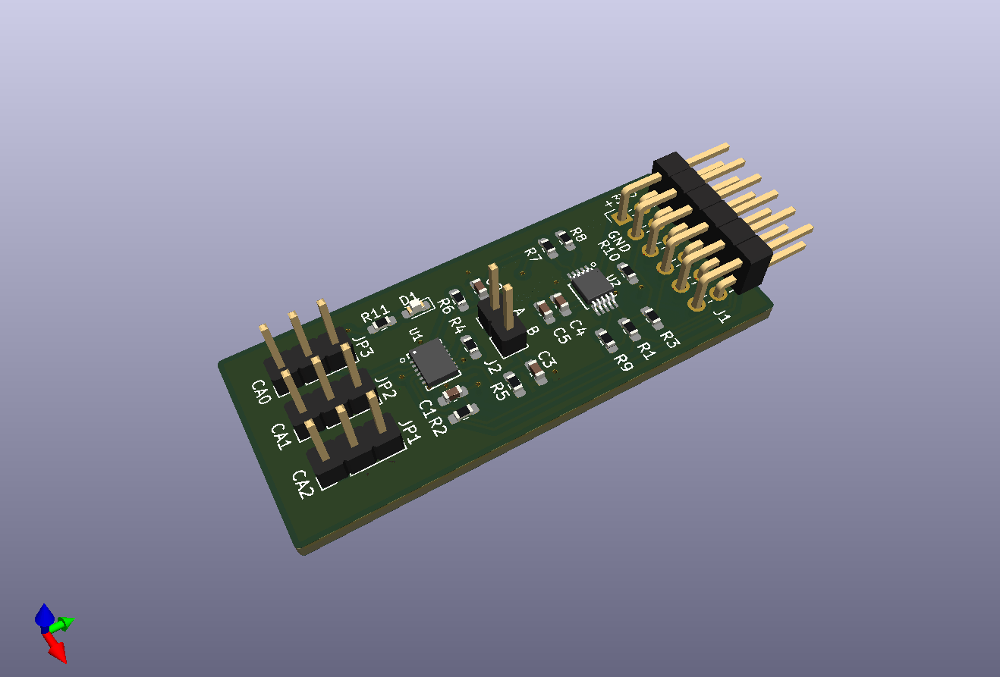
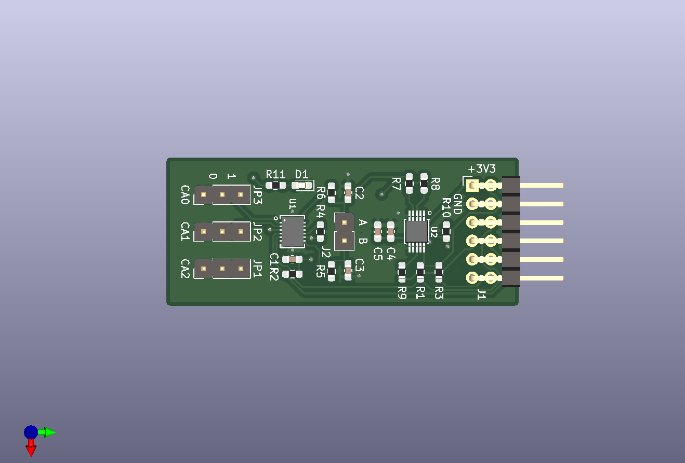
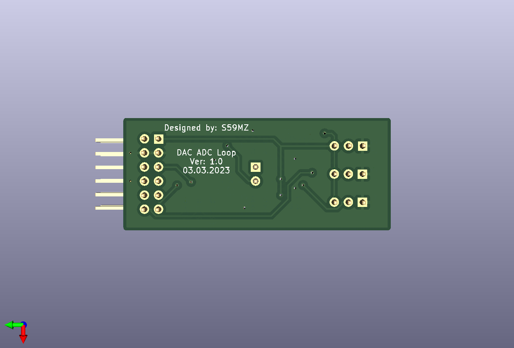

# dac_adc_pmod
PMOD PCB module with LTC2627 (I2C-DAC) and LTC2402 (SPI-ADC) loopback

Schematic:
[dac_adc_pmod.pdf](dac_adc_pmod.pdf)

BOM:
[dac_adc_pmod.csv](dac_adc_pmod.csv)

Gerbers:
[gerbers.zip](https://github.com/s59mz/kicad-dac-adc-loop/raw/main/gerbers.zip)
